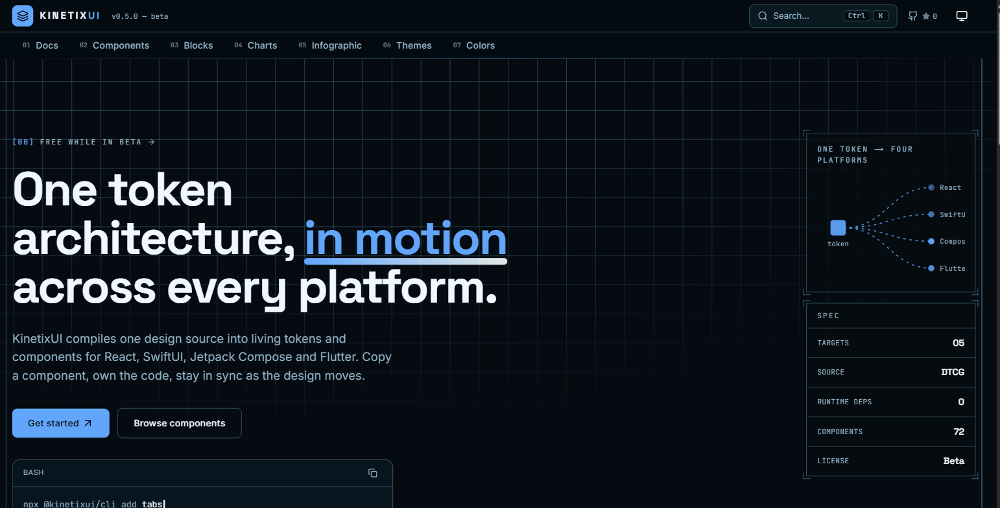

<div align="center">

# KinetixUI

**One token architecture, in motion across every platform.**

KinetixUI compiles a single design source into living tokens and a component
library for **React, SwiftUI, Jetpack Compose, and Flutter** — the same
components, the same token contract, on all four platforms at parity. Copy a
component in via the CLI, own the code, and re‑theme with a token edit everywhere
at once.

Free while in beta.

[**Docs**](https://kinetixui.com/docs) ·
[Components](https://kinetixui.com/components) ·
[Colors](https://kinetixui.com/colors) ·
[Changelog](https://kinetixui.com/docs/changelog)

[](https://github.com/zedalleys/kinetixui/actions/workflows/ci.yml)
[](https://www.npmjs.com/package/@kinetixui/ui)
[](LICENSE)

</div>

---

<div align="center">
  <a href="https://kinetixui.com">
    
  </a>
</div>

## Quick start

```bash
# copy components into your project (you own the code)
npx @kinetixui/cli init
npx @kinetixui/cli add button card dialog

# …or take a versioned dependency
npm i @kinetixui/tokens @kinetixui/ui
```

`@kinetixui/ui` is also installable through the shadcn registry at
`https://kinetixui.com/r/*.json`. Full setup — Tailwind preset, the token
contract import, dark mode — is in [Installation](https://kinetixui.com/docs/installation).

## What you get

- **A DTCG token engine.** `tokens/**` → Style Dictionary v4 → CSS custom
  properties (light + dark, HSL channels), a typed `tokens` object, and native
  colour + type sets for SwiftUI / Compose / Flutter. One edit re‑skins every
  platform.
- **72 React components** (`@kinetixui/ui`) — CVA + Radix + Tailwind, styled only
  against the semantic token layer, never a hex.
- **Four‑platform parity.** [`ui-compose`](packages/ui-compose),
  [`ui-swiftui`](packages/ui-swiftui) and [`ui-flutter`](packages/ui-flutter)
  each carry a 1:1 port of the React surface (~68 `Kinetix*` components) on the
  same token contract, compiled in CI per platform. Standing non‑ports: `Form`,
  `NavigationMenu`, `Combobox`.
- **A portable registry.** Every component serialised to a shadcn‑compatible JSON
  descriptor, served static from `kinetixui.com/r/`.
- **A first‑party CLI** (`@kinetixui/cli`) — `init` scaffolds `kinetixui.json` +
  the token contract; `add <name>` resolves registry dependencies, installs npm
  deps with your package manager, and writes the source into your tree.
- **Accessibility, gated in CI.** Radix keyboard/ARIA, `focus-visible` `--ring`
  outlines, and `pnpm check:contrast` — every semantic token pair audited against
  WCAG AA, light and dark. See [Accessibility](https://kinetixui.com/docs/accessibility).
- **Token‑driven chart recipes** over Recharts, with loading / empty / error
  states and a screen‑reader data table — see [Charts](https://kinetixui.com/charts).

## Packages

| Package | Registry | What |
|---|---|---|
| [`@kinetixui/tokens`](packages/tokens) | npm | The compiled token contract — CSS vars, `tokens.ts`, native colour + type sets |
| [`@kinetixui/ui`](packages/ui) | npm + shadcn registry | The React component library + Tailwind preset |
| [`@kinetixui/cli`](packages/cli) | npm | The install CLI (`init` / `add` / `list`) |
| [`ui-compose`](packages/ui-compose) | — (Gradle) | Jetpack Compose port |
| [`ui-swiftui`](packages/ui-swiftui) | — (SwiftPM) | SwiftUI port |
| [`ui-flutter`](packages/ui-flutter) | — (Dart) | Flutter port |

## Monorepo layout

```
kinetixui/
├─ tokens/                 DTCG token source
│  ├─ primitives/          colour ramps · spacing · radius · type
│  └─ semantic/            semantic aliases (light + dark) · shadows · text styles
├─ style-dictionary/       build.mjs · sd.config.mjs · hooks.mjs (web + iOS + Android + Flutter)
├─ packages/
│  ├─ tokens/              @kinetixui/tokens — dist/{web,ios,android,flutter}
│  ├─ ui/                  @kinetixui/ui — React
│  ├─ ui-compose/          Jetpack Compose port (Gradle)
│  ├─ ui-swiftui/          SwiftUI port (SwiftPM)
│  ├─ ui-flutter/          Flutter port (Dart)
│  └─ cli/                 @kinetixui/cli
├─ registry/               registry.json manifest + source files
├─ scripts/                gen-registry · gen-docs · gen-stories · check-contrast · vendor-*
└─ apps/
   ├─ docs/                Storybook 8 (private)
   └─ web/                 kinetixui.com — Next.js App Router, built on @kinetixui/ui (private)
                           built registry served from apps/web/public/r/
```

## Working in the repo

pnpm workspace + Turborepo. Node 22, pnpm (see `packageManager` in `package.json`).

| Command | Does |
|---|---|
| `pnpm build:tokens` | `style-dictionary/build.mjs` → `packages/tokens/dist/{web,ios,android,flutter}` |
| `pnpm vendor:compose` · `vendor:swiftui` · `vendor:flutter` | copy the generated native token files into each port (after `build:tokens`) |
| `pnpm build:registry` | regenerate `registry/` + `shadcn build` → `apps/web/public/r/` |
| `pnpm check:contrast` | audit every semantic token pair against WCAG AA |
| `pnpm gen:stories` · `gen:docs` | regenerate Storybook stories / component doc pages from the demo registry |
| `pnpm test` · `pnpm typecheck` · `pnpm lint` | Turborepo, across the workspace |
| `pnpm dev:web` | kinetixui.com dev server on `:3000` |
| `pnpm storybook` | Storybook dev server on `:6006` |

CI (`ci.yml`) builds tokens → ui → registry → site and runs the `@kinetixui/ui`
tests on every push/PR; it fails if generated output (`packages/tokens/dist`,
`apps/web/public/r`) is stale. `native-{compose,swiftui,flutter}.yml` compile the
ports.

### Adding a component — the four‑platform rule

A component isn't done until it ships on **all four** platforms (or is a
documented non‑port), CI‑verified per platform. The full workflow is in
[Contributing](https://kinetixui.com/docs/contributing).

### Releasing

Changesets‑driven: `pnpm changeset` to describe a change; on merge to `main` the
Release workflow opens a **Version Packages** PR, and merging that publishes
`@kinetixui/{tokens,ui,cli}` to npm (they share one version line). `apps/web` and
`apps/docs` are private and never published.

## License

[MIT](LICENSE) © KinetixUI
