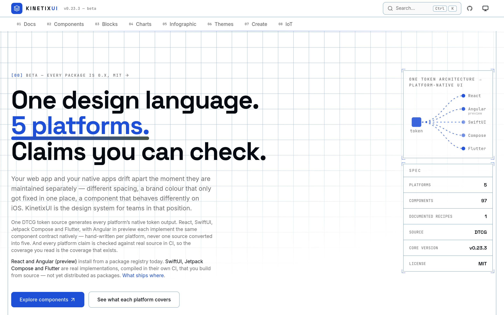

<div align="center">

# KinetixUI

**A design system for teams on more than one platform — with cross-platform
claims verified against source in CI.**

Your web app and your native apps drift apart the moment they are maintained
separately. KinetixUI is the design system for teams in that position:
**one DTCG token source** generates every platform's native token output, and
**components are implemented natively per platform** — **React, SwiftUI,
Jetpack Compose and Flutter**, with **Angular in preview**.

The token contract is shared; the component code is hand-written for each
platform, **never one source converted into five**. And every platform claim is
checked against real source in CI — a component cannot say it runs on SwiftUI
unless SwiftUI source exists. Coverage is generated and published on
[/docs/platforms](https://kinetixui.com/docs/platforms) rather than asserted
here, gaps included.

**What installs, and what you compile.** React and Angular (preview) install
from npm. SwiftUI, Jetpack Compose and Flutter are real implementations,
compiled by their own CI on every change, **not yet distributed as packages** —
you build them from source. That is a fact about package registries, not about
the implementations.

MIT licensed, all of it.

[**Docs**](https://kinetixui.com/docs) ·
[Components](https://kinetixui.com/components) ·
[Create](https://kinetixui.com/create) ·
[Changelog](https://kinetixui.com/docs/changelog)

[](https://github.com/zedalleys/kinetixui/actions/workflows/ci.yml)
[](https://www.npmjs.com/package/@kinetixui/ui)
[](LICENSE)

</div>

---

<div align="center">
  <a href="https://kinetixui.com">
    
  </a>
</div>

**[See one interface, four native implementations →](https://kinetixui.com/#flagship)** — a real
"Notification preferences" panel, rendered live in React, with the actual SwiftUI, Jetpack Compose
and Flutter source alongside it — each compiled by that platform's own CI, not typed by hand for
the page.

## Quick start

```bash
# copy components into your project (you own the code)
npx @kinetixui/cli init
npx @kinetixui/cli add button card dialog

# …or take a versioned dependency
npm i @kinetixui/tokens @kinetixui/ui
```

`@kinetixui/ui` is also installable through the shadcn registry at
`https://kinetixui.com/r/*.json`. Full setup — Tailwind preset, the token
contract import, dark mode — is in [Installation](https://kinetixui.com/docs/installation).

## What you get

- **A DTCG token engine.** `tokens/**` → Style Dictionary → CSS custom
  properties (light + dark, HSL channels), a typed `tokens` object, and native
  colour + type sets for SwiftUI / Compose / Flutter. One edit re‑skins every
  platform.
- **React components** (`@kinetixui/ui`) — CVA + Radix + Tailwind, styled only
  against the semantic token layer, never a hex.
- **Cross‑platform by default.** [`ui-compose`](packages/ui-compose),
  [`ui-swiftui`](packages/ui-swiftui) and [`ui-flutter`](packages/ui-flutter)
  each carry a 1:1 port of the React surface on the
  same token contract, compiled in CI per platform. Per-platform coverage and the documented exceptions (React‑only or partial) live
  in [`components.manifest.json`](components.manifest.json) and are listed, with the
  reason for each, at [kinetixui.com/docs/platforms](https://kinetixui.com/docs/platforms).
- **A portable registry.** Every component serialised to a shadcn‑compatible JSON
  descriptor, served static from `kinetixui.com/r/`.
- **A first‑party CLI** (`@kinetixui/cli`) — `init` scaffolds `kinetixui.json` +
  the token contract; `add <name>` resolves registry dependencies, installs npm
  deps with your package manager, and writes the source into your tree.
- **Accessibility, gated in CI.** Radix keyboard/ARIA, `focus-visible` `--ring`
  outlines, and `pnpm check:contrast` — every semantic token pair audited against
  WCAG AA, light and dark. See [Accessibility](https://kinetixui.com/docs/accessibility).
- **Token‑driven chart recipes** over Recharts, with loading / empty / error
  states and a screen‑reader data table — see [Charts](https://kinetixui.com/charts).

## Packages

| Package | Distribution | What |
|---|---|---|
| [`@kinetixui/tokens`](packages/tokens) | npm | The compiled token contract — CSS vars, `tokens.ts`, native colour + type sets |
| [`@kinetixui/ui`](packages/ui) | npm + shadcn registry | The React component library + Tailwind preset |
| [`@kinetixui/cli`](packages/cli) | npm | The install CLI (`init` / `add` / `list` / `inspect` / `parity` / `lint` / `doctor` / `theme` / `preset`) |
| [`@kinetixui/angular`](packages/ui-angular) | npm — **Preview** | Angular standalone components and directives. Versions independently |
| [`@kinetixui/iot`](packages/iot) | npm — **Experimental** | Connected-device semantics and React patterns. Versions independently |
| [`ui-swiftui`](packages/ui-swiftui) | **not distributed** — build from source (SwiftPM) | SwiftUI port |
| [`ui-compose`](packages/ui-compose) | **not distributed** — build from source (Gradle) | Jetpack Compose port |
| [`ui-flutter`](packages/ui-flutter) | **not distributed** — build from source (Dart) | Flutter port |

`@kinetixui/{tokens,ui,cli}` share one version line. `@kinetixui/angular` and
`@kinetixui/iot` version independently, so no single number describes the whole
product — run `pnpm marketing:stats` for the current set.

## Monorepo layout

```
kinetixui/
├─ tokens/                 DTCG token source
│  ├─ primitives/          colour ramps · spacing · radius · type
│  └─ semantic/            semantic aliases (light + dark) · shadows · text styles
├─ style-dictionary/       build.mjs · sd.config.mjs · hooks.mjs (web + iOS + Android + Flutter)
├─ packages/
│  ├─ tokens/              @kinetixui/tokens — dist/{web,ios,android,flutter}
│  ├─ ui/                  @kinetixui/ui — React
│  ├─ ui-angular/          @kinetixui/angular — Angular (Preview), built by ng-packagr
│  ├─ iot/                 @kinetixui/iot — connected-device module (Experimental)
│  ├─ ui-compose/          Jetpack Compose port (Gradle, not distributed)
│  ├─ ui-swiftui/          SwiftUI port (SwiftPM, not distributed)
│  ├─ ui-flutter/          Flutter port (Dart, not distributed)
│  ├─ create-theme/        theme engine + native exporters (private)
│  ├─ create-preset/       preset codec for kinetixui.com/create (private)
│  └─ cli/                 @kinetixui/cli
├─ registry/               registry.json manifest + source files
├─ scripts/                gen-registry · gen-docs · gen-stories · check-contrast · vendor-*
└─ apps/
   ├─ docs/                Storybook 8 (private)
   └─ web/                 kinetixui.com — Next.js App Router, built on @kinetixui/ui (private)
                           built registry served from apps/web/public/r/
```

## Working in the repo

pnpm workspace + Turborepo. Node 22, pnpm (see `packageManager` in `package.json`).

| Command | Does |
|---|---|
| `pnpm build:tokens` | `style-dictionary/build.mjs` → `packages/tokens/dist/{web,ios,android,flutter}` |
| `pnpm vendor:compose` · `vendor:swiftui` · `vendor:flutter` | copy the generated native token files into each port (after `build:tokens`) |
| `pnpm build:registry` | regenerate `registry/` + `shadcn build` → `apps/web/public/r/` |
| `pnpm check:contrast` | audit every semantic token pair against WCAG AA |
| `pnpm gen:stories` · `gen:docs` | regenerate Storybook stories / component doc pages from the demo registry |
| `pnpm test` · `pnpm typecheck` · `pnpm lint` | Turborepo, across the workspace |
| `pnpm dev:web` | kinetixui.com dev server on `:3000` |
| `pnpm storybook` | Storybook dev server on `:6006` |

CI (`ci.yml`) builds tokens → ui → iot → angular → registry → site, runs all
five JavaScript test suites plus the release tooling, typechecks every
workspace, and runs the contrast, RTL, typography, grid, manifest and platform
guardrails. Eight of its steps are **drift checks**: they fail when generated
documentation stops matching the source it was generated from (component
snippets, usage examples, Block snippets, IoT examples, the flagship homepage
example, icon mappings, verification evidence, and generated-file sync).
`native-{compose,swiftui,flutter}.yml` compile the ports; `a11y-browser.yml` and
`a11y-site.yml` run real-browser axe passes in light and dark.

### Adding a component — the platform rule

A component isn't done until it ships on all four **catalogue‑complete**
platforms — React, SwiftUI, Jetpack Compose, Flutter — or is a documented
non‑port, compiled in CI per platform. Angular is a fifth implementation,
still Preview and rolling out in waves, so it is not required.

Compiling is not the same as being verified. What automated tests actually
prove about each implementation is tracked separately, per component and per
platform, in `verification.json`; see
[Supported platforms](https://kinetixui.com/docs/platforms). The full workflow
is in [Contributing](https://kinetixui.com/docs/contributing).

### Releasing

Changesets‑driven: `pnpm changeset` to describe a change; on merge to `main` the
Release workflow opens a **Version Packages** PR, and merging that publishes
whatever that PR versioned. There are three release cohorts, declared in
[`release/publish-packages.json`](release/publish-packages.json):
`core` (`@kinetixui/{tokens,ui,cli}`, one shared version line), `angular`
(`@kinetixui/angular`) and `iot` (`@kinetixui/iot`), each on its own lifecycle.
A release in one cohort never publishes or re-tags another.

Publication is gated: the preflight builds, packs, validates every tarball
against its `requireFiles`, smoke-tests each one in a clean consumer and
dry-run publishes — all before the first upload — and each version is confirmed
on the registry before any git tag is created. Every package publishes with npm
provenance. `apps/web`, `apps/docs`, `create-theme` and `create-preset` are
private and never published.

## Governance

Contributing: [`CONTRIBUTING.md`](CONTRIBUTING.md). Maintainer/decision-making
structure, and what changes once more than one person is maintaining this:
[`GOVERNANCE.md`](GOVERNANCE.md). Security issues: [`SECURITY.md`](SECURITY.md).

## License

[MIT](LICENSE) © KinetixUI
